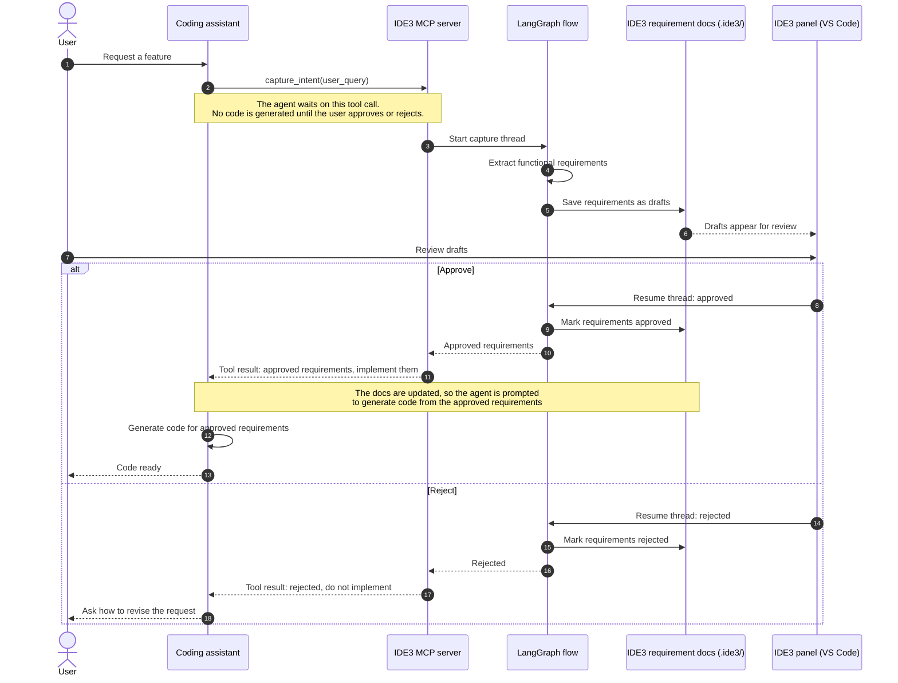

```mermaid
sequenceDiagram
    autonumber
    actor User
    participant Agent as Coding assistant
    participant MCP as IDE3 MCP server
    participant Graph as LangGraph flow
    participant Docs as IDE3 requirement docs (.ide3/)
    participant Panel as IDE3 panel (VS Code)

    User->>Agent: Request a feature
    Agent->>MCP: capture_intent(user_query)
    Note over Agent,MCP: The agent waits on this tool call.<br/>No code is generated until the user approves or rejects.
    MCP->>Graph: Start capture thread
    Graph->>Graph: Extract functional requirements
    Graph->>Docs: Save requirements as drafts
    Docs-->>Panel: Drafts appear for review
    User->>Panel: Review drafts

    alt Approve
        Panel->>Graph: Resume thread: approved
        Graph->>Docs: Mark requirements approved
        Graph-->>MCP: Approved requirements
        MCP-->>Agent: Tool result: approved requirements, implement them
        Note over Agent,Docs: The docs are updated, so the agent is prompted<br/>to generate code from the approved requirements
        Agent->>Agent: Generate code for approved requirements
        Agent-->>User: Code ready
    else Reject
        Panel->>Graph: Resume thread: rejected
        Graph->>Docs: Mark requirements rejected
        Graph-->>MCP: Rejected
        MCP-->>Agent: Tool result: rejected, do not implement
        Agent-->>User: Ask how to revise the request
    end
```