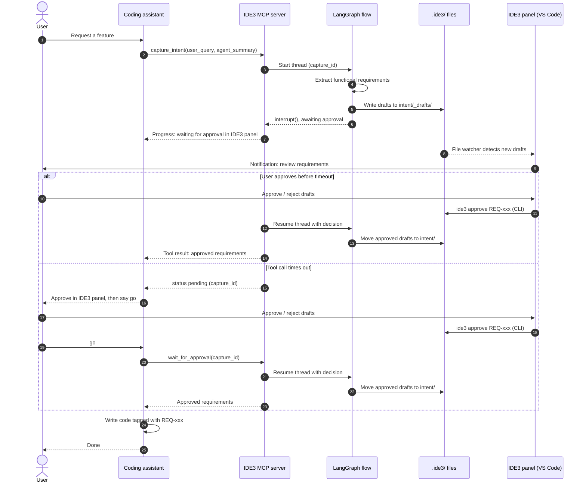

```mermaid
sequenceDiagram
    autonumber
    actor User
    participant Agent as Coding assistant
    participant MCP as IDE3 MCP server
    participant Graph as LangGraph flow
    participant Store as .ide3/ files
    participant Panel as IDE3 panel (VS Code)

    User->>Agent: Request a feature
    Agent->>MCP: capture_intent(user_query, agent_summary)
    MCP->>Graph: Start thread (capture_id)
    Graph->>Graph: Extract functional requirements
    Graph->>Store: Write drafts to intent/_drafts/
    Graph-->>MCP: interrupt(), awaiting approval
    MCP-->>Agent: Progress: waiting for approval in IDE3 panel
    Store-->>Panel: File watcher detects new drafts
    Panel->>User: Notification: review requirements

    alt User approves before timeout
        User->>Panel: Approve / reject drafts
        Panel->>Store: ide3 approve REQ-xxx (CLI)
        MCP->>Graph: Resume thread with decision
        Graph->>Store: Move approved drafts to intent/
        MCP-->>Agent: Tool result: approved requirements
    else Tool call times out
        MCP-->>Agent: status pending (capture_id)
        Agent-->>User: Approve in IDE3 panel, then say go
        User->>Panel: Approve / reject drafts
        Panel->>Store: ide3 approve REQ-xxx (CLI)
        User->>Agent: go
        Agent->>MCP: wait_for_approval(capture_id)
        MCP->>Graph: Resume thread with decision
        Graph->>Store: Move approved drafts to intent/
        MCP-->>Agent: Approved requirements
    end

    Agent->>Agent: Write code tagged with REQ-xxx
    Agent-->>User: Done
```